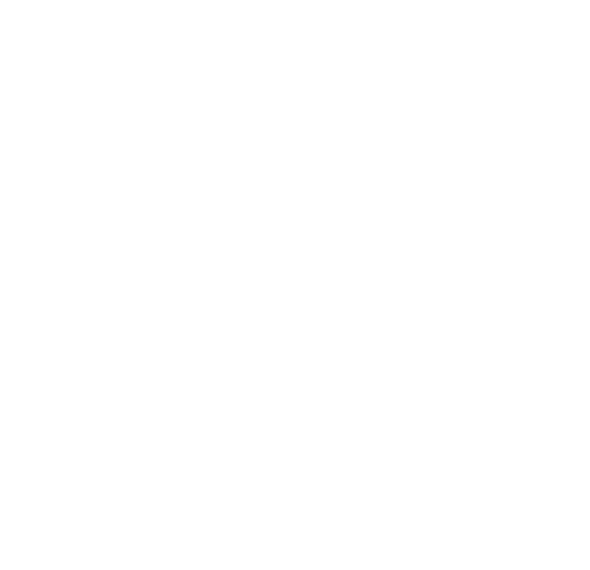

# Algeria Map - 69 Wilayas SVG

A comprehensive, multilingual SVG map of Algeria featuring all 69 administrative divisions (wilayas) with detailed metadata in Arabic, Latin, and structured data attributes.



## Overview

This project provides a high-quality, scalable vector graphics (SVG) map of Algeria's 69 wilayas (provinces). Each wilaya is represented as a separate path element with rich metadata including official names in Arabic and Latin scripts, making it ideal for interactive web applications, data visualization, and geographic information systems.

## Features

- **Complete Coverage**: All 69 wilayas of Algeria
- **Multilingual Support**: Names in both Arabic (official) and Latin scripts
- **Structured Data**: Consistent naming conventions and data attributes
- **Scalable**: Vector format ensures perfect quality at any size
- **Web-Ready**: Optimized for use in web applications and interactive maps
- **Accessible**: Semantic IDs and data attributes for easy DOM manipulation

## Documentation

- **[Usage Examples](docs/USAGE_EXAMPLES.md)** - HTML, JavaScript, React examples and styling
- **[Wilayas List](docs/WILAYAS_LIST.md)** - Complete table of all 69 wilayas
- **[Technical Specifications](docs/TECHNICAL_SPECS.md)** - SVG format details and browser compatibility
- **[Integration Guide](docs/INTEGRATION.md)** - Leaflet.js and D3.js integration
- **[Contributing](docs/CONTRIBUTING.md)** - Guidelines, roadmap, and changelog
- **[FAQ](docs/FAQ.md)** - Frequently asked questions and resources

## Quick Start

```html
<!DOCTYPE html>
<html>
<head>
    <style>
        #algeria-map-69-wilaya path {
            fill: #bcbec0;
            stroke: #333;
            cursor: pointer;
            transition: fill 0.3s;
        }
        #algeria-map-69-wilaya path:hover {
            fill: #2ecc71;
        }
    </style>
</head>
<body>
    <div id="map-container">
        <!-- Include algeria-svg.svg here -->
    </div>
</body>
</html>
```

See [Usage Examples](docs/USAGE_EXAMPLES.md) for more detailed implementations.

## License

This project is licensed under the MIT License - see below for details:

```
MIT License

Copyright (c) 2026 Algeria Map SVG Project

Permission is hereby granted, free of charge, to any person obtaining a copy
of this software and associated documentation files (the "Software"), to deal
in the Software without restriction, including without limitation the rights
to use, copy, modify, merge, publish, distribute, sublicense, and/or sell
copies of the Software, and to permit persons to whom the Software is
furnished to do so, subject to the following conditions:

The above copyright notice and this permission notice shall be included in all
copies or substantial portions of the Software.

THE SOFTWARE IS PROVIDED "AS IS", WITHOUT WARRANTY OF ANY KIND, EXPRESS OR
IMPLIED, INCLUDING BUT NOT LIMITED TO THE WARRANTIES OF MERCHANTABILITY,
FITNESS FOR A PARTICULAR PURPOSE AND NONINFRINGEMENT. IN NO EVENT SHALL THE
AUTHORS OR COPYRIGHT HOLDERS BE LIABLE FOR ANY CLAIM, DAMAGES OR OTHER
LIABILITY, WHETHER IN AN ACTION OF CONTRACT, TORT OR OTHERWISE, ARISING FROM,
OUT OF OR IN CONNECTION WITH THE SOFTWARE OR THE USE OR OTHER DEALINGS IN THE
SOFTWARE.
```

## Acknowledgments

- Geographic data based on official Algerian administrative divisions
- Arabic names follow official government designations
- Latin transliterations follow standard conventions

## Support

- **Issues**: [GitHub Issues](https://github.com/chemsallioua/algeria-map-svg/issues)
- **Discussions**: [GitHub Discussions](https://github.com/chemsallioua/algeria-map-svg/discussions)
- **Email**: support@example.com (replace with your contact)

---

**Made with ❤️ for Algeria** | **الجزائر**

If you find this useful, please ⭐ star the repository!
